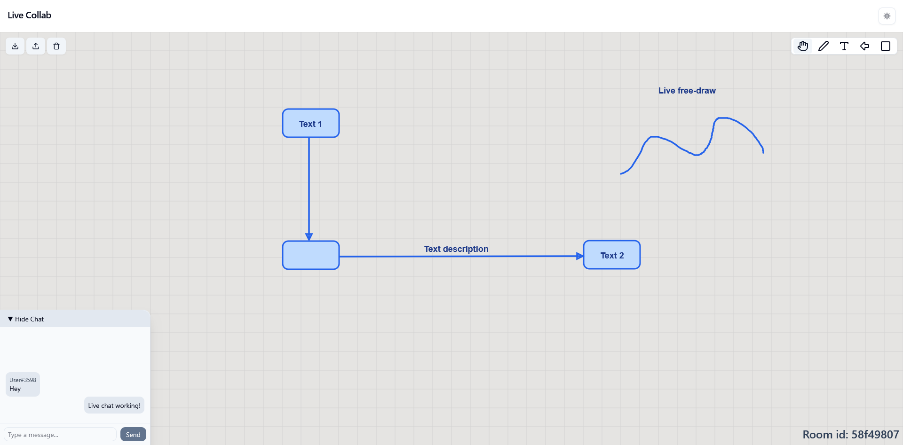

# Collab

A realtime collaborative whiteboard and chat app, built to practice modern fullstack development with a clean, modular stack. Users can join rooms, sketch ideas together, and exchange messages in real time.

## Tech Stack

- Backend: FastAPI with WebSockets for realtime collaboration
- Frontend: React + TypeScript (Vite) with React Router for site navigation
- UI: shadcn/ui components for a consistent interface
- Deployment: Minimal Docker setup for easy deployment on Render


## Demo

https://collab-1rww.onrender.com - may take a minute to spin up

## Screenshots
Two users interacting realtime

Landing page / room creation


## Run Locally

Prerequisites:
- Docker

Clone the project

```bash
  git clone https://github.com/jakub022/collab.git
```

Go to the project directory

```bash
  cd collab
```

Build the Docker image

```bash
  docker build -t collab .
```

Run the Docker container

```bash
  docker run -p 8080:8080 collab
```